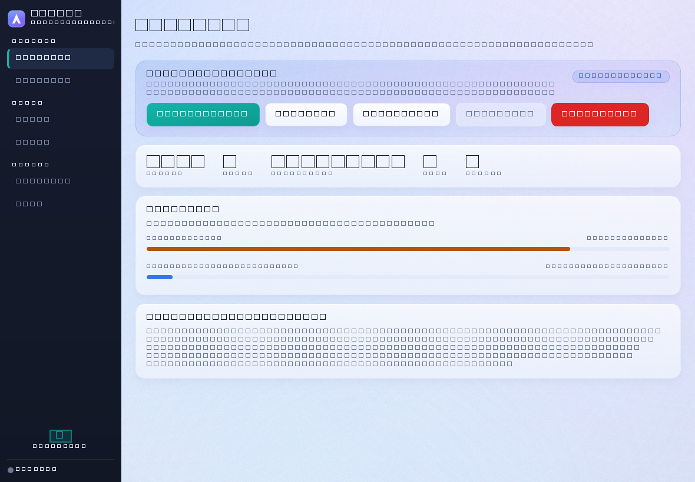
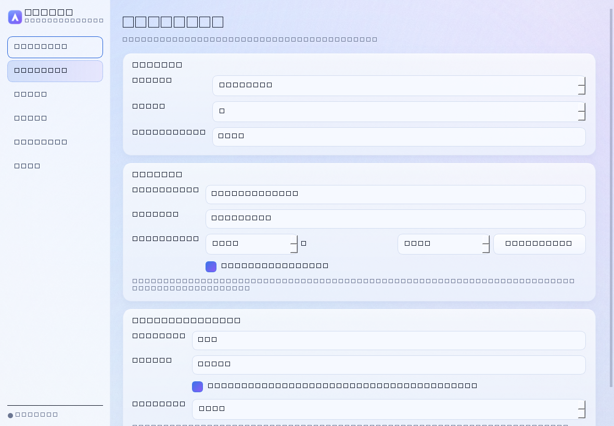
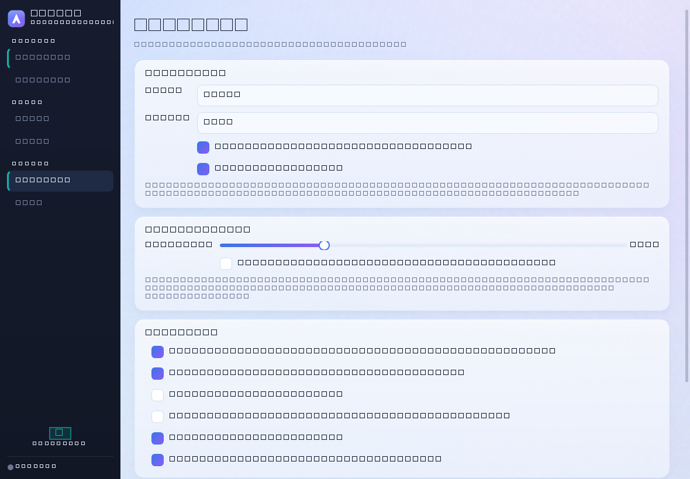

# ArchVM Manager

[](https://github.com/nikhlgoel/ArchVM-manager/actions/workflows/ci.yml)
[](https://github.com/nikhlgoel/ArchVM-manager/releases/latest)
[](LICENSE)
[](#requirements)

A Windows desktop application that installs and runs **Arch Linux with Hyprland**
in QEMU — including a guided setup wizard that finds what your PC is missing and
installs it for you.

`virt-manager` is Linux-only, so managing plain QEMU on Windows means hand-written
command lines. This fills that gap.



<details>
<summary>More screenshots</summary>

| | |
|---|---|
|  |  |
|  |  |

</details>

---

## What it does

- **Guided setup** — scans for virtualization support, QEMU, disk space, firmware
  and the Arch ISO; installs or downloads whatever is missing behind a *single*
  administrator prompt.
- **Fully automated Arch install** — three staged scripts partition the disk,
  `pacstrap` the base system, and then build the desktop on first login.
- **Hyprland desktop** — [end-4/dots-hyprland](https://github.com/end-4/dots-hyprland)
  (illogical-impulse) with the [pctrade/end4-pc](https://github.com/pctrade/end4-pc)
  Quickshell fork layered on top, finishing at a graphical SDDM login.
- **Host → guest text injection** — QEMU has no clipboard channel, so the app
  types text in over the QEMU monitor.
- **System tray** — closing the window keeps it running; full right-click menu.
- **Light/dark theming** with Windows 11 Mica translucency, and accessibility
  throughout (screen-reader names, 80–160% text scaling, full keyboard control).

---

## A note on GPU passthrough

**A discrete GPU cannot be passed through to a VM on a Windows host.** Not by this
app, and not by any other:

- **Hyper-V DDA** — the only real PCIe passthrough on Windows — requires Windows
  **Server**. Home and Pro are both excluded.
- **QEMU on Windows** runs on the **WHPX** accelerator, which has no VFIO support
  at all. VFIO requires a Linux host.
- **Laptop dGPUs** are typically muxless: they render into the iGPU's framebuffer
  and have no independent display path for a guest to drive.

Instead the VM uses **`virtio-vga` with Mesa's software renderer**. Hyprland
runs and is usable, but compositing happens on the CPU.

> **virgl does not work on Windows.** `virtio-vga-gl` needs DMABUF to present
> its scanout, and no Windows QEMU display backend provides it — GTK aborts with
> *"GtkGLArea console lacks DMABUF support"*, and SDL stays running but never
> renders. Earlier versions of this project defaulted to that pairing and
> produced a black window or a dead QEMU process. The GL options are no longer
> offered, and a saved configuration containing one is corrected on load.

If you want real GPU acceleration, that means bare metal: dual-boot.

---

## Requirements

| | |
|---|---|
| OS | Windows 10/11 (x64) |
| CPU | VT-x / AMD-V enabled in firmware |
| RAM | 8 GB minimum, 16 GB comfortable |
| Disk | 60 GB free minimum, 140 GB recommended |
| Software | QEMU — the wizard installs it via `winget` if absent |

The wizard also enables the **Windows Hypervisor Platform** feature (needs a
reboot) and adds the **OpenSSH client**, both with your approval.

---

## Download

Grab the latest build from the [releases page](https://github.com/nikhlgoel/ArchVM-manager/releases/latest):

| File | Use it when |
|---|---|
| `ArchVM-<version>-windows-x64-setup.exe` | **Recommended.** Installs properly: Start Menu entry, optional desktop shortcut, uninstaller in Add/Remove Programs. Per-user by default, so no UAC prompt; choose system-wide during setup if you prefer. |
| `ArchVM-<version>-windows-x64.zip` | Portable. Unzip anywhere and run `ArchVM.exe`. Touches nothing outside the folder. |
| `ArchVM-<version>-windows-x64-portable.exe` | Portable, single file. Tidiest, a few seconds slower to start. |
| `seed-<version>.iso` | Only if you are rebuilding the seed ISO by hand. The app generates its own. |

Uninstalling leaves your VM disks and ISOs alone, and asks before removing
settings in `%APPDATA%\ArchVM`.

Verify your download against `SHA256SUMS.txt`:

```powershell
Get-FileHash .\ArchVM-2.1.1-windows-x64.zip -Algorithm SHA256
```

Releases are **not code-signed**, so SmartScreen will warn on first run — choose
*More info → Run anyway*. See [`docs/code-signing.md`](docs/code-signing.md) for
why, and what it would take to change.

### Windows only

This is not a portability oversight. The app is built on `winget`, `dism`, the
Windows registry and Win32 APIs, and exists because `virt-manager` does not run
on Windows. **On Linux, use `virt-manager`** — it is a better tool than a port of
this one would be. There is no macOS build.

---

## Running from source

```bash
git clone https://github.com/nikhlgoel/ArchVM-manager.git
cd ArchVM-manager
pip install -r requirements.txt
python app/run.py
```

Or build a standalone executable:

```bash
cd app
python build.py            # -> dist/ArchVM/ArchVM.exe
```

### Where the VM data lives

Disks and ISOs are large, so you choose where they go: **Settings → Locations →
Change**. The app repoints its configuration and restarts. Existing files are
left where they are rather than silently copied — a virtual disk can be a
hundred gigabytes — so move them across yourself if you want to keep them.

The lookup order is the `ARCHVM_ROOT` environment variable, the path saved in
settings, `D:\ArchVM`, then the repository root.

---

## Layout

```
app/            the desktop application
  archvm/       paths, config, theme, icons, qemu, widgets, window, tray,
                deps (environment detection), onboarding (setup wizard)
  build.py      icon generation + PyInstaller + shortcuts
  run.py        source-tree launcher
  installer/    archvm.iss - the Inno Setup installer definition
  tools/        icon generators and the offscreen smoke test
seed/           the three-stage Arch installer that runs inside the VM
manager/        build_seed.py — packs the installer scripts into seed.iso
docs/           VM guide, code-signing guide, screenshots
.github/        CI and release workflows, issue and PR templates
```

`seed/vm.conf` holds the guest username and passwords in plain text and is
**git-ignored**. Copy `seed/vm.conf.example` to `seed/vm.conf`, or let the setup
wizard write it.

**The scripts in `seed/` must keep LF line endings.** CRLF breaks them inside
Linux; `build_seed.py` normalises on build, but configure your editor too.

---

## Documentation

- [`docs/vm-guide.md`](docs/vm-guide.md) — install walkthrough, keyboard notes,
  troubleshooting, Hyprland keybinds
- [`app/README.md`](app/README.md) — module layout, theming, accessibility,
  setup-wizard internals
- [`docs/code-signing.md`](docs/code-signing.md) — why the builds are unsigned,
  and the options for changing that
- [`CONTRIBUTING.md`](CONTRIBUTING.md) — development setup, house style, scope
- [`CHANGELOG.md`](CHANGELOG.md) — what changed in each release
- [`SECURITY.md`](SECURITY.md) — reporting vulnerabilities, and an honest account
  of what the app does with administrator rights

---

## Licence

MIT — see [LICENSE](LICENSE).

Desktop configuration belongs to its authors:
[end-4/dots-hyprland](https://github.com/end-4/dots-hyprland) and
[pctrade/end4-pc](https://github.com/pctrade/end4-pc).
